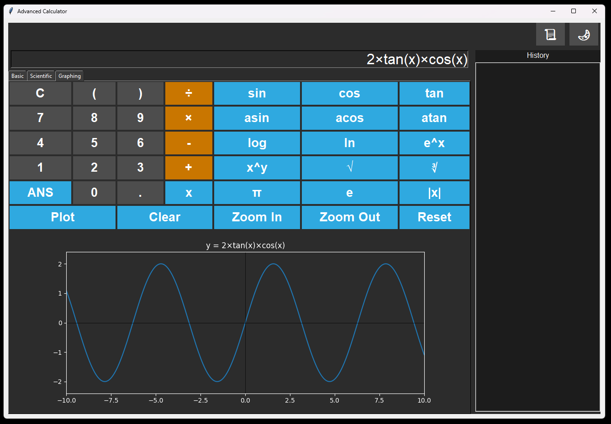

# CalcMAX

The pyCalculator is a feature-rich graphical user interface (GUI) application built using Python and Tkinter. It supports basic, scientific, and graphing calculations, providing users with a comprehensive tool for mathematical operations. The calculator includes a modern UI design with simulated rounded corners for buttons and supports both light and dark themes.



## Features

### Basic Calculations
    - Standard arithmetic operations (+, -, ×, ÷)
    - Percentage calculation (%)
    - Negation toggle (±)

### Scientific Calculations
    - Trigonometric functions (sin, cos, tan) and their inverses (asin, acos, atan)
    - Hyperbolic functions (sinh, cosh, tanh)
    - Logarithmic functions (log, ln)
    - Exponential functions (e^x)
    - Square root (√) and cube root (∛)
    - Power functions (x^y)
    - Constants (π, e)
    - Absolute value (|x|)
    - Factorial and modulus

### Graphing Capabilities
    - Plot mathematical functions
    - Zoom in and out of graphs (being fixed)
    - Reset graph view (being fixed)
    - Modern UI Design
    - Light and dark themes with easy toggle
    - Responsive layout that adapts to window resizing
    - History display for the last 10 calculations
    - Prerequisites
    - Python 3.x
    - Required Python libraries:
    - tkinter (comes with Python standard library)
    - matplotlib
    - numpy
    - sympy

### Installation
To install the required libraries, run the following commands:
```
pip install matplotlib numpy sympy
```
Running the Application
To run the application, execute the following command:
```
python calc.py
```

### Acknowledgments
This project was built using the following resources:


Tkinter documentation: https://docs.python.org/3/library/tk.html

Matplotlib documentation: https://matplotlib.org/stable/tutorials

NumPy documentation: https://numpy.org/doc/

SymPy documentation: https://docs.sympy.org/latest/index.html